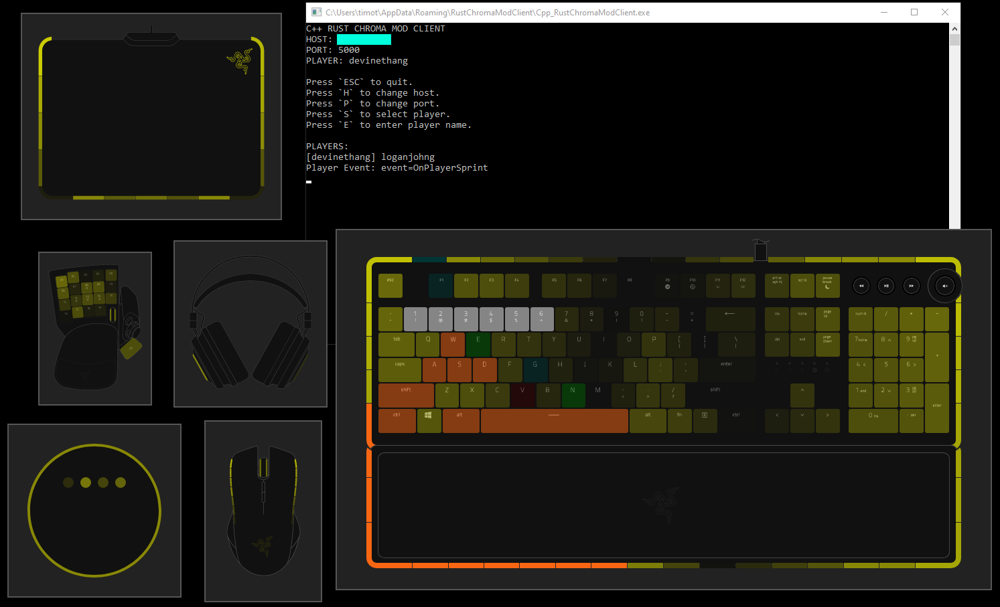
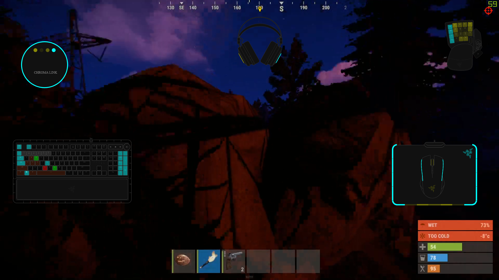

# Overview

This is the C++ RUST Chroma Mod Client.



# Installer

* [Rust Chroma Mod Client - Windows 32-bit Installer](https://github.com/tgraupmann/Cpp_RustChromaModClient/releases/tag/1.0)

# Chroma Effects

* Keyboard Hotkeys

* Sprint

* Jump

* Duck

* Player Respawn

* Player Death

* Player Connected/Disconnected

* Fire Crossbow

* Hit Rock with Rock

* Hit Tree with Rock

* Hit Rock with Hatchet

* Hit Hatchet on Corpse

* Throw Spear

* On Loot

* Switch to Torch

* Switch to Rock

* Switch Active Items


# Setup

* Install the [RUST Chroma Mod](https://github.com/tgraupmann/RustChromaMod) on the server.

* Launch the server

* Launch the RUST game from Steam and connect to the server

* Press `F1` on the main menu and enter the connect command in the console

```
client.connect <SERVER_IP_ADDRESS>:28015
```

* Run the `C++ RUST Chroma Mod Client`

* Enter the hostname of the server

* Enter the mod port of the server (default 5000)

* Select the player or enter the player name

* Chroma events will fire when RUST events are detected on the server

# Streaming

* Streamers can broadcast their Chroma RGB lighting to viewers with [Razer Chroma RGB for Streamers](https://www.microsoft.com/store/apps/9PG8DNKL06M6)



## Support

Contact `Tim Graupmann#0611` on Discord for support.
